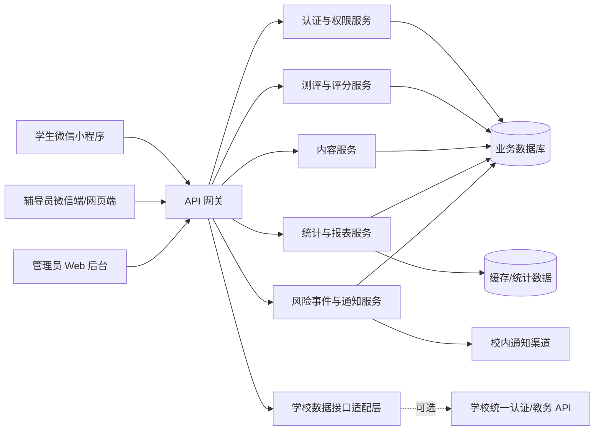

# 大学生心理健康监测微信小程序开发文档

## 1. 文档信息

| 项目 | 内容 |
|---|---|
| 项目名称 | 大学生心理健康监测微信小程序 |
| 文档类型 | 产品需求与技术开发规格说明书 |
| 文档版本 | V1.0 |
| 编制日期 | 2026-07-29 |
| 当前状态 | 需求初稿，可用于产品设计、技术评审和项目立项 |
| 目标平台 | 微信小程序、辅导员端、管理员端 |
| 主要用户 | 学生、辅导员、系统管理员 |

## 2. 项目概述

### 2.1 项目背景

高校学生可能面临学业、就业、人际关系、家庭、情感和环境适应等多方面压力。学校通常通过心理测评、心理健康教育、辅导员观察和心理咨询等方式开展支持工作，但传统测评容易出现组织成本高、结果反馈慢、数据分散和后续跟进困难等问题。

本项目计划建设一款大学生心理健康监测微信小程序，通过问卷答题、评分分析、心理健康科普和自助建议，为学生提供便捷的心理状态自评工具，并帮助有权限的辅导员了解所负责班级的整体情况。系统同时提供管理员端，用于维护学期、组织、班级、学生、辅导员和测评任务等数据。

### 2.2 产品定位

本产品定位为：

- 面向大学生的心理健康教育、状态自评和求助引导工具
- 面向辅导员的班级心理健康趋势观察和工作辅助工具
- 面向学校管理人员的数据维护、任务配置和权限管理工具
- 面向学校心理健康工作体系的信息化辅助平台

本产品不属于医疗诊断系统，不能替代心理咨询师、精神科医生或其他专业人员的诊断和治疗。系统评分只能用于筛查、教育和风险提示，不得直接生成疾病诊断结论。

### 2.3 建设目标

1. 为学生提供操作简单、反馈及时的心理状态自评服务。
2. 为学生提供心理健康科普、常见问题和自助建议。
3. 为辅导员提供班级测评完成情况、分数分布和风险提示。
4. 建立从测评、预警、查看、跟进到记录的工作闭环。
5. 支持每学期学生、班级和辅导员关系的调整。
6. 为未来接入学校统一身份认证和数据 API 预留标准接口。
7. 在满足业务需求的同时，保护学生隐私和心理健康敏感数据。

## 3. 项目范围

### 3.1 本期范围

- 学生、辅导员和管理员三类账号
- 学号或工号身份激活与登录
- 微信身份绑定
- 心理健康问卷配置、发布、答题和评分
- 多维度结果分析及五边形雷达图
- 学生个人历史测评记录
- 辅导员班级学生列表和测评查看
- 班级完成率、得分分布和趋势图
- 风险等级提示及跟进记录
- 心理健康科普、常见问题和自助建议
- 趣味人格测试模块
- 学期、院系、专业、班级和人员关系管理
- Excel/CSV 批量导入
- 权限、日志和隐私同意管理

### 3.2 暂不纳入本期

- 自动进行心理疾病诊断
- 自动替代专业人员完成危机干预
- 未经学校批准直接连接校内数据库
- 将学生个人测评数据公开给其他学生
- 将趣味人格测试作为心理健康风险判断依据
- 未经评估使用生成式人工智能提供治疗建议
- 面向社会公众提供在线医疗或心理诊疗服务

## 4. 用户角色与权限

### 4.1 学生

学生是小程序的主要使用者。

主要权限：

- 使用学号和独立密码激活或登录账号
- 绑定本人微信身份
- 查看本人基本信息和所属班级
- 查看负责本人的辅导员信息
- 查看待完成、进行中和已完成的测评任务
- 回答测评题目并提交
- 查看本人测评结果、维度得分和历史趋势
- 查看心理健康科普、自助建议和求助渠道
- 参加趣味人格测试
- 查看隐私政策并管理个人授权
- 申请更正不准确的基础信息

限制：

- 只能查看本人的测评和结果
- 不能查看其他学生的数据
- 不能修改评分规则和风险等级
- 不能查看班级排名或其他学生的个人分数

### 4.2 辅导员

辅导员负责查看其被授权班级的测评情况并开展必要的跟进工作。

主要权限：

- 使用工号或管理员分配的账号登录
- 查看本人负责的院系、专业、班级和学生
- 查看班级测评任务完成率
- 查看班级得分区间、维度分布和时间趋势
- 查看有权限学生的测评结果
- 查看系统生成的风险提示
- 对风险提示进行确认、标记和跟进
- 填写跟进状态和必要的工作记录
- 导出经过授权和脱敏的数据报表

限制：

- 只能访问当前学期分配给本人的班级和学生
- 默认只查看完成状态、风险等级和必要摘要
- 查看原始答题记录需要额外权限并记录审计日志
- 不得将学生心理数据用于处分、公开排名或无关评价
- 不得修改学生原始答题记录和系统评分快照

### 4.3 系统管理员

管理员负责平台配置和基础数据维护，不应默认拥有查看全部心理测评原始内容的权限。

主要权限：

- 管理学期、校区、院系、专业、班级
- 创建和维护学生、辅导员及其他管理员账号
- 配置辅导员与班级的对应关系
- 导入和同步人员数据
- 管理问卷、版本、题目、选项和评分规则
- 发布、暂停和关闭测评任务
- 管理科普文章和自助资源
- 配置角色、权限和数据访问范围
- 查看系统运行日志、导入日志和安全审计记录
- 配置学校心理中心、紧急联系人和求助信息

限制：

- 系统运维管理员与心理业务管理员应尽量分权
- 查看敏感测评数据必须具有明确业务授权
- 所有敏感数据访问和导出必须保留审计记录

## 5. 核心业务流程

### 5.1 学生首次使用流程

1. 学生打开微信小程序。
2. 阅读用户协议、隐私政策和敏感个人信息处理说明。
3. 使用学号和初始密码或激活码验证身份。
4. 系统校验学生基础信息。
5. 学生设置独立密码并绑定微信身份。
6. 系统展示学生姓名、班级和辅导员，请学生确认。
7. 学生进入首页查看测评任务和健康内容。

### 5.2 学生测评流程

1. 学生进入待完成测评列表。
2. 查看测评目的、题目数量、预计耗时和数据使用范围。
3. 单独确认本次敏感信息处理授权。
4. 开始答题，系统自动保存答题进度。
5. 提交前检查是否存在漏答题目。
6. 提交后由评分引擎计算总分、维度分和风险规则。
7. 保存不可篡改的结果快照。
8. 向学生展示适当的结果解释、自助建议和求助方式。
9. 如果触发高风险规则，展示即时求助提示并进入人工处置流程。

### 5.3 辅导员查看与跟进流程

1. 辅导员登录系统。
2. 首页展示负责班级的任务完成率、风险数量和趋势摘要。
3. 辅导员进入某个班级查看学生测评状态。
4. 根据权限查看学生结果摘要或原始答题内容。
5. 对风险提示进行确认，填写跟进状态。
6. 必要时转交学校心理中心或其他有资质人员。
7. 系统记录处理人、时间、状态和操作日志。

### 5.4 管理员学期数据维护流程

1. 创建新学期。
2. 导入院系、专业、班级、学生和辅导员数据。
3. 系统进行格式、重复值和关联关系校验。
4. 管理员预览新增、修改、停用和冲突数据。
5. 确认后执行导入。
6. 配置辅导员与班级的对应关系。
7. 发布本学期测评任务。
8. 保留历史学期数据，不覆盖历史结果。

## 6. 功能需求

### 6.1 登录与身份认证

| 编号 | 功能 | 优先级 | 说明 |
|---|---|---:|---|
| AUTH-01 | 微信会话登录 | P0 | 使用微信登录能力获取临时凭证，由后端换取用户会话 |
| AUTH-02 | 学号/工号激活 | P0 | 使用学校预置身份信息完成首次账号激活 |
| AUTH-03 | 独立密码登录 | P0 | 密码必须加密哈希存储，不能明文保存 |
| AUTH-04 | 微信身份绑定 | P0 | 一个校内身份原则上只绑定一个有效微信账号 |
| AUTH-05 | 找回密码 | P1 | 通过管理员重置、学校认证或已验证渠道完成 |
| AUTH-06 | 登录安全 | P0 | 支持失败次数限制、验证码、会话失效和异常登录记录 |
| AUTH-07 | 角色识别 | P0 | 登录后根据角色进入学生端、辅导员端或管理端 |

身份设计要求：

- 不建议直接收集学生现有的教务系统密码。
- 如果学校暂时没有统一认证接口，应使用系统独立密码或一次性激活码。
- 如果未来获得学校统一身份认证能力，应优先使用学校 SSO/OAuth/CAS 等标准方式。
- 辅导员和管理员账号建议启用二次验证。

### 6.2 学生首页

- 展示问候语和必要的隐私提示。
- 展示当前学期及所属班级。
- 展示辅导员姓名和学校公开的工作联系方式。
- 展示待完成测评数量和最近一次结果摘要。
- 展示心理健康科普内容。
- 展示学校心理中心和紧急求助入口。
- 高风险学生再次进入时，不应暴露带有污名化含义的标签。

### 6.3 测评任务

- 支持按全校、院系、专业、班级或指定学生发布任务。
- 支持设置开始时间、截止时间和可答次数。
- 支持必答题和选答题。
- 支持单选、多选、量表、是非和矩阵题。
- 支持题目随机、选项随机和分页。
- 支持暂存与继续答题。
- 支持提交确认，提交后默认不可修改。
- 特殊情况重新作答必须由授权人员操作并保留记录。
- 每次任务必须固定问卷版本，避免后续改题影响历史结果。

### 6.4 问卷与评分引擎

评分引擎应支持：

- 选项直接赋分
- 正向题和反向题
- 多选题组合计分
- 按维度汇总
- 总分计算
- 分值标准化
- 风险阈值配置
- 关键题独立触发规则
- 不同人群使用不同常模或解释规则
- 评分规则版本化
- 结果解释模板

建议输出以下结果：

1. 原始总分。
2. 标准化分数。
3. 各维度得分。
4. 当前风险等级。
5. 与本人历史结果的变化趋势。
6. 经专业人员审核的结果解释。
7. 对应的科普、自助和求助建议。

不建议仅使用一个“心理健康值”概括全部情况。产品界面可以使用“心理状态指数”，但必须同时展示维度和解释，避免学生将单一分数理解为医学诊断。

### 6.5 五维雷达图

五边形雷达图可用于展示五个心理状态维度。初步建议维度如下：

1. 情绪状态
2. 压力负荷
3. 睡眠与精力
4. 人际适应
5. 学业与环境适应

以上维度只用于产品原型，正式上线前必须由心理学专业人员根据最终量表确认。

显示要求：

- 统一转换为 0 至 100 的可视化区间。
- 明确分数方向，例如分数越高表示状态越好或风险越高。
- 雷达图必须配合文字说明，不能单独作为结论。
- 支持查看不同时间的个人变化。
- 不向其他学生展示个人雷达图。

### 6.6 学生结果页

- 展示完成时间和问卷名称。
- 展示总分、维度分和结果说明。
- 展示五维雷达图和个人历史趋势。
- 提供与结果相匹配的科普文章和自助建议。
- 提供学校心理中心预约或联系方式。
- 明确说明结果不是疾病诊断。
- 高风险结果优先展示求助指引，不使用恐吓性文案。
- 结果页不得显示“你有某种精神疾病”等未经专业诊断的结论。

### 6.7 心理健康科普

内容分类建议：

- 压力管理
- 情绪调节
- 睡眠健康
- 学业适应
- 人际关系
- 恋爱与情感
- 就业与未来规划
- 常见心理问题
- 如何寻求专业帮助
- 危机识别与求助

内容管理要求：

- 文章必须标记作者、审核人、发布时间和更新时间。
- 医疗及心理专业内容需要经过专业人员审核。
- 不得发布可能诱导自伤、污名化或替代治疗的内容。
- 支持收藏、搜索和相关推荐。

### 6.8 常见问题与自助建议

- 采用问题分类和关键词搜索。
- 提供简单、低风险的自助练习。
- 所有建议必须明确适用范围。
- 持续或严重困扰应引导寻求专业支持。
- 不得承诺治疗效果。

### 6.9 趣味人格测试

趣味人格测试用于提高参与度，与心理健康筛查模块分开。

产品要求：

- 可以提供类似 16 类型的人格探索体验。
- 页面明确标注“娱乐和自我探索用途”。
- 结果不用于心理健康评分、风险预警或管理决策。
- 默认不向辅导员展示个人趣味测试结果。
- 使用“MBTI”名称、题库或官方类型材料前，应确认商标、版权和授权要求。
- 未取得授权时，建议使用“16 型人格探索”等通用名称和自研题目。

### 6.10 辅导员工作台

工作台应展示：

- 负责班级数量和学生数量
- 当前测评任务
- 班级完成率
- 未完成人数
- 不同风险等级人数
- 最近风险提示
- 班级得分分布
- 各维度平均值
- 与上次测评的变化趋势

辅导员可以：

- 按班级、任务、完成状态和风险等级筛选学生
- 查看学生测评时间和结果摘要
- 查看个人历史趋势
- 对风险提示进行确认
- 记录已联系、待联系、已转介等状态
- 将事项转交心理中心

### 6.11 班级可视化

支持以下图表：

- 测评完成率环形图
- 分数区间柱状图
- 风险等级分布图
- 班级五维平均雷达图
- 不同时间测评趋势折线图
- 院系或班级对比图

隐私要求：

- 班级统计用于工作分析，不生成公开排名。
- 人数过少的分组应隐藏或合并，防止反推出个人。
- 导出报表默认脱敏。
- 可视化只展示当前账号有权访问的数据。

### 6.12 风险提示与跟进

建议设置四级状态：

| 等级 | 含义 | 系统动作 |
|---|---|---|
| 正常 | 暂未发现明显风险 | 展示一般性健康建议 |
| 关注 | 某些维度需要关注 | 推荐相关内容，进入观察列表 |
| 较高风险 | 需要人工复核 | 通知有权限的辅导员或心理中心人员 |
| 紧急风险 | 可能涉及即时安全问题 | 显示紧急求助信息并进入学校危机流程 |

设计原则：

- 风险等级和触发规则必须由学校心理专业人员确认。
- 特定关键题可以绕过总分直接触发人工复核。
- 系统只负责提示和流转，不自动作出医学判断。
- 紧急风险必须由学校事先制定联系人、值班和转介流程。
- 每个风险事件应记录创建、通知、查看、确认、跟进和关闭时间。
- 未按时处理的风险事件可以按学校规则升级提醒。

## 7. 页面与信息架构

### 7.1 学生端页面

1. 启动页
2. 登录/激活页
3. 用户协议与隐私授权页
4. 学生首页
5. 辅导员信息页
6. 测评任务列表
7. 测评说明页
8. 答题页
9. 提交确认页
10. 测评结果页
11. 历史趋势页
12. 科普内容列表
13. 文章详情页
14. 常见问题页
15. 趣味人格测试页
16. 求助资源页
17. 个人中心

### 7.2 辅导员端页面

1. 辅导员工作台
2. 班级列表
3. 班级数据概览
4. 学生列表
5. 学生详情
6. 测评结果详情
7. 风险事件列表
8. 跟进记录页
9. 报表与导出页
10. 个人中心

### 7.3 管理端页面

管理员功能较复杂，建议使用独立的电脑 Web 管理后台。

1. 系统概览
2. 学期管理
3. 组织架构管理
4. 班级管理
5. 学生管理
6. 辅导员管理
7. 辅导员与班级分配
8. 数据导入与同步
9. 问卷管理
10. 题目和评分规则管理
11. 测评任务管理
12. 内容管理
13. 角色与权限
14. 风险规则配置
15. 操作日志
16. 数据导出审批
17. 系统配置

## 8. 技术架构

### 8.1 总体架构



### 8.2 推荐技术方案

#### 微信小程序

- 微信小程序原生框架
- TypeScript
- 微信开发者工具
- 统一设计组件库
- 支持小程序的图表组件
- 网络请求、错误处理和权限判断统一封装

选择原生小程序方案的原因：

- 对微信能力支持完整
- Android 与 iOS 微信客户端兼容性较好
- 依赖较少，便于控制包体积和性能
- 适合处理登录、授权和消息能力

#### 管理后台

- Vue 3 或 React
- TypeScript
- 适配桌面浏览器
- 使用成熟的后台管理组件库

#### 后端

推荐方案：

- Java + Spring Boot
- MySQL 或 PostgreSQL
- Redis
- 对象存储用于非敏感静态资源
- Nginx 或云负载均衡
- Docker 容器化部署

可选方案：

- Node.js + NestJS

最终技术栈应根据开发团队经验、学校运维条件和现有系统确定。

### 8.3 部署环境

至少建立三套环境：

| 环境 | 用途 | 数据要求 |
|---|---|---|
| 开发环境 | 开发和单元测试 | 使用虚构数据 |
| 测试环境 | 集成测试和验收 | 使用脱敏或模拟数据 |
| 生产环境 | 正式运行 | 存储真实数据，执行最高安全策略 |

生产环境建议部署在学校认可的中国大陆数据中心、学校私有云或校内机房。是否使用微信云开发，需要由学校对数据存储位置、安全能力和运维责任进行评估后决定。

## 9. 数据模型

### 9.1 核心数据表

| 数据表 | 主要用途 |
|---|---|
| users | 统一账号、角色和状态 |
| student_profiles | 学生基础信息 |
| counselor_profiles | 辅导员基础信息 |
| semesters | 学期信息 |
| departments | 院系信息 |
| majors | 专业信息 |
| classes | 班级信息 |
| enrollments | 学生与班级、学期关系 |
| counselor_assignments | 辅导员与班级关系 |
| questionnaires | 问卷基本信息 |
| questionnaire_versions | 问卷版本 |
| questionnaire_items | 题目 |
| questionnaire_options | 选项及分值 |
| assessment_tasks | 测评发布任务 |
| task_targets | 测评任务适用对象 |
| response_sessions | 一次答题会话 |
| responses | 题目回答 |
| assessment_results | 总分、维度分和结果快照 |
| risk_events | 风险提示事件 |
| followup_records | 辅导员或心理中心跟进记录 |
| consent_records | 协议和敏感信息授权记录 |
| content_articles | 科普与自助内容 |
| import_jobs | 数据导入任务和结果 |
| external_identity_mappings | 外部学校系统身份映射 |
| audit_logs | 敏感操作审计记录 |

### 9.2 数据设计原则

- 使用内部随机 ID，避免在接口中直接暴露学号。
- 学号、姓名、联系方式和测评结果分字段保护。
- 问卷和评分规则必须版本化。
- 提交后的原始回答和结果快照不能被普通业务操作覆盖。
- 学期调整通过新增关系记录实现，不修改历史归属。
- 删除账号时根据学校政策进行停用、匿名化或删除。
- 审计日志不得记录密码、完整令牌和不必要的原始回答。

## 10. API 设计示例

### 10.1 公共与认证接口

```text
POST /api/v1/auth/wechat-session
POST /api/v1/auth/activate
POST /api/v1/auth/login
POST /api/v1/auth/logout
POST /api/v1/auth/refresh
GET  /api/v1/me
GET  /api/v1/privacy-notices/current
POST /api/v1/consents
```

### 10.2 学生接口

```text
GET  /api/v1/student/dashboard
GET  /api/v1/student/counselor
GET  /api/v1/student/assessment-tasks
GET  /api/v1/student/assessment-tasks/{taskId}
POST /api/v1/student/response-sessions
PUT  /api/v1/student/response-sessions/{sessionId}/answers
POST /api/v1/student/response-sessions/{sessionId}/submit
GET  /api/v1/student/results
GET  /api/v1/student/results/{resultId}
GET  /api/v1/student/result-trends
GET  /api/v1/content/articles
GET  /api/v1/content/articles/{articleId}
```

### 10.3 辅导员接口

```text
GET  /api/v1/counselor/dashboard
GET  /api/v1/counselor/classes
GET  /api/v1/counselor/classes/{classId}/summary
GET  /api/v1/counselor/classes/{classId}/students
GET  /api/v1/counselor/students/{studentId}
GET  /api/v1/counselor/students/{studentId}/results
GET  /api/v1/counselor/risk-events
POST /api/v1/counselor/risk-events/{eventId}/acknowledge
POST /api/v1/counselor/risk-events/{eventId}/followups
```

### 10.4 管理接口

```text
POST /api/v1/admin/semesters
POST /api/v1/admin/import-jobs
GET  /api/v1/admin/import-jobs/{jobId}
POST /api/v1/admin/import-jobs/{jobId}/confirm
GET  /api/v1/admin/counselors
POST /api/v1/admin/counselors
POST /api/v1/admin/counselors/{staffId}/reset-password
PATCH /api/v1/admin/counselors/{staffId}/status
GET  /api/v1/admin/classes?semesterId={semesterId}
POST /api/v1/admin/counselor-assignments
PATCH /api/v1/admin/counselor-assignments
POST /api/v1/admin/questionnaires
POST /api/v1/admin/questionnaires/{id}/versions
POST /api/v1/admin/assessment-tasks
POST /api/v1/admin/assessment-tasks/{id}/publish
GET  /api/v1/admin/audit-logs
```

### 10.5 API 通用要求

- 全部生产接口使用 HTTPS。
- 使用短期访问令牌和可撤销刷新令牌。
- 后端必须重新校验角色和数据范围，不能只依赖前端隐藏按钮。
- 所有接口返回统一错误码和追踪编号。
- 答题提交接口必须支持幂等，防止重复提交。
- 敏感查询、导出和权限变更写入审计日志。
- 接口按账号、设备和 IP 设置合理频率限制。

## 11. 学校数据 API 接入方案

目前不能确定学校是否提供数据 API，因此系统采用分阶段设计。

### 11.1 方案 A：文件导入

适用于没有学校 API 的情况。

- 管理员下载标准 Excel/CSV 模板。
- 导入学生、辅导员、班级和对应关系。
- 系统进行字段和关联校验。
- 展示导入差异和错误明细。
- 管理员确认后正式写入。
- 每次导入保留批次和回滚记录。

这是第一期必须实现的兜底方案。

### 11.2 方案 B：只读数据同步

适用于学校提供教务系统或统一数据平台 API 的情况。

- 定时获取院系、专业、班级和人员数据。
- 使用学校唯一人员编号进行匹配。
- 新增、变更和停用通过差异任务处理。
- 不直接覆盖历史测评关系。
- 同步失败时保留旧数据并通知管理员。

### 11.3 方案 C：统一身份认证

适用于学校提供 SSO、OAuth、CAS 或其他统一认证能力的情况。

- 用户通过学校统一身份认证登录。
- 小程序只保存必要的身份映射。
- 不收集和保存教务系统密码。
- 认证接口与业务接口分离。

### 11.4 接入前需要学校确认

- 是否提供统一身份认证
- 是否提供学生和教职工目录 API
- 是否提供院系、专业、班级和学期数据
- 接口协议、鉴权方式和访问频率
- 数据字段和唯一标识
- 测试环境与测试账号
- 数据使用审批流程
- 网络和服务器部署要求
- 接口故障责任人和服务等级

## 12. 隐私、安全与合规

### 12.1 数据性质

学生身份、心理测评回答、结果、风险等级和跟进记录属于高度敏感数据。心理健康相关数据应按照敏感个人信息进行保护。

系统上线前至少需要：

- 明确学校作为个人信息处理者的责任
- 制定隐私政策和敏感个人信息处理说明
- 对敏感数据处理取得单独同意
- 开展个人信息保护影响评估
- 明确数据保存期限和删除规则
- 建立安全事件响应机制
- 由学校法务、信息化部门和心理专业部门共同审核

### 12.2 最小必要原则

- 只收集完成身份确认、测评和支持服务所需的数据。
- 不收集通讯录、精确位置等无关信息。
- 不将学校现有账号密码保存到本系统。
- 不默认向辅导员展示全部原始答案。
- 不将趣味人格数据用于风险判断。
- 不将学生数据用于广告或商业画像。

### 12.3 权限控制

- 使用基于角色和数据范围的访问控制。
- 辅导员只能访问被分配班级。
- 心理中心人员、辅导员和系统管理员分权。
- 敏感权限定期复核。
- 学期关系变化后及时撤销旧权限。
- 数据导出需要审批和水印。

### 12.4 技术安全

- 传输过程使用 TLS。
- 密码使用 Argon2id、bcrypt 等安全算法哈希处理。
- 高敏感字段采用数据库字段级加密。
- 密钥通过专用密钥管理服务保存。
- 生产数据库不允许从公网直接访问。
- 定期备份并测试恢复流程。
- 日志脱敏，禁止记录完整测评答案和认证令牌。
- 防范 SQL 注入、越权访问、跨站脚本和文件上传风险。
- 定期执行依赖漏洞扫描和渗透测试。

### 12.5 用户权利

系统应支持学生：

- 查看个人信息处理规则
- 查询本人基础信息和测评记录
- 更正不准确的基础信息
- 撤回可撤回的授权
- 申请删除或匿名化符合条件的数据
- 了解数据使用目的和访问对象
- 联系学校的数据保护或业务负责人

### 12.6 合规参考

- [《中华人民共和国个人信息保护法》](https://www.npc.gov.cn/WZWSREL25wYy9jMi9jMzA4MzQvMjAyMTA4L3QyMDIxMDgyMF8zMTMwODguaHRtbD9yZWY9aW1i)
- [《中华人民共和国数据安全法》](https://www.miit.gov.cn/zwgk/zcwj/flfg/art/2022/art_284b390b84484f10b0e43eeafaad0f6d.html)
- [中央网信办个人信息保护政策法规问答（2026年1月）](https://www.cac.gov.cn/2026-01/09/c_1769688003183197.htm)
- [教育部关于全面推进健康学校建设的指导意见](https://www.moe.gov.cn/srcsite/A17/moe_943/moe_946/202602/t20260227_1429365.html)

## 13. 非功能需求

### 13.1 兼容性

- 支持主流 Android 和 iOS 微信客户端。
- 以微信当前支持的稳定基础库为基线。
- 不依赖特定手机厂商能力。
- 适配常见屏幕尺寸、安全区域和字体缩放。
- 核心功能在低端设备上保持可用。
- 图表在 Android 和 iOS 上保持一致。

### 13.2 性能

- 普通页面首屏目标在良好网络下 2 秒内可用。
- 普通 API 请求目标响应时间不超过 1 秒。
- 统计类复杂查询目标响应时间不超过 3 秒。
- 答题过程本地暂存，网络恢复后可继续。
- 大型报表采用异步生成。

### 13.3 可用性

- 生产服务月度可用性目标不低于 99.9%。
- 答题提交需要防止数据重复和丢失。
- 数据库故障后可从备份恢复。
- 高风险事件通知失败需要自动重试。

### 13.4 易用性与无障碍

- 使用清晰、温和和非污名化的语言。
- 关键按钮具有明确反馈。
- 支持字体放大。
- 颜色不是表达风险状态的唯一方式。
- 图表同时提供文字摘要。
- 答题页显示进度并支持返回确认。

## 14. 测试方案

### 14.1 功能测试

- 三类角色登录和权限
- 学生与班级关系
- 测评发布和目标范围
- 答题暂存、恢复和提交
- 正向题、反向题和多维评分
- 关键题风险触发
- 结果展示和历史趋势
- 辅导员数据范围
- 管理员导入和学期变更
- 科普内容发布

### 14.2 评分测试

- 为每套问卷建立标准答案与预期结果样本。
- 覆盖最低分、最高分和阈值边界。
- 验证反向题和缺失题处理。
- 对评分规则进行双人复核。
- 评分引擎升级后执行完整回归测试。
- 上线前由心理专业人员确认量表、维度和解释。

### 14.3 权限与安全测试

- 学生尝试访问他人结果
- 辅导员尝试访问非负责班级
- 管理员越权查看测评原始数据
- 直接修改接口参数绕过前端限制
- 登录暴力尝试和令牌重放
- 敏感日志检查
- 导出权限和审计记录
- 常见 Web 和 API 安全测试

### 14.4 兼容性测试

最低测试范围：

- iPhone 主流屏幕尺寸
- Android 主流品牌和屏幕尺寸
- 较新和较旧的微信稳定版本
- Wi-Fi、移动网络和弱网
- 深色模式
- 字体缩放
- 小程序冷启动和热启动

### 14.5 用户验收测试

验收人员应包括：

- 学生代表
- 辅导员代表
- 学校心理中心专业人员
- 学校信息化部门
- 系统管理员
- 隐私或法务负责人

## 15. 项目实施阶段

### 阶段一：需求与合规确认

- 明确学校业务负责人
- 确认心理量表和授权
- 确认风险处理流程
- 确认数据权限和保存期限
- 确认学校 API 情况
- 输出原型和最终需求文档

### 阶段二：MVP 开发

建议包含：

- 三类账号和权限
- 学期、班级和人员导入
- 学生登录与微信绑定
- 问卷发布、答题和评分
- 学生结果页
- 辅导员班级查看
- 基础统计和风险提示
- 隐私同意和审计日志

### 阶段三：内容与可视化

- 五维雷达图
- 班级趋势和分布
- 心理健康科普
- 自助建议
- 内容审核流程
- 报表导出

### 阶段四：增强功能

- 学校 API 和统一身份认证
- 趣味人格测试
- 高级统计分析
- 通知和跟进闭环优化
- 心理中心协同功能

### 阶段五：试点与上线

- 选择少量班级试点
- 收集使用反馈
- 完成安全和隐私评估
- 修复问题
- 进行数据备份和应急演练
- 分批扩大使用范围

## 16. MVP 验收标准

1. 学生可以使用有效身份激活并登录。
2. 学生只能访问本人数据。
3. 学生可以完成测评并获得正确结果。
4. 评分结果与审核后的标准样本一致。
5. 辅导员只能查看负责班级。
6. 辅导员可以查看完成率、结果摘要和风险事件。
7. 管理员可以导入人员并配置班级关系。
8. 管理员可以创建并发布测评任务。
9. 所有敏感访问和导出均有审计记录。
10. Android 和 iOS 微信客户端核心流程通过测试。
11. 高风险规则能够生成事件并进入人工跟进流程。
12. 学生能够查看隐私说明和敏感信息处理说明。
13. 系统明确提示测评不构成医疗诊断。
14. 生产环境通过安全测试和学校上线审批。

## 17. 主要风险

| 风险 | 影响 | 应对措施 |
|---|---|---|
| 学校 API 不可用 | 无法自动同步人员 | 首期提供 Excel/CSV 导入 |
| 量表或题目未经授权 | 法律和专业风险 | 上线前确认来源、授权和适用人群 |
| 评分解释不科学 | 可能误导学生 | 由心理专业人员审核并建立标准样本 |
| 数据泄露 | 对学生造成严重影响 | 加密、分权、审计、最小必要和安全测试 |
| 辅导员越权查看 | 侵犯学生隐私 | 班级范围授权和敏感访问审计 |
| 高风险事件无人处理 | 学生安全风险 | 建立责任人、通知、确认和升级机制 |
| 学生不愿真实作答 | 数据质量下降 | 清晰说明隐私边界，避免惩罚性使用 |
| 将趣味测试用于管理 | 误用和歧视风险 | 与健康测评分离，禁止用于风险判断 |
| 图表在不同手机异常 | 影响使用 | 建立 Android/iOS 兼容测试矩阵 |

## 18. 上线前待确认事项

以下事项必须由项目负责人和学校相关部门确认：

1. 项目正式名称。
2. 学校是否提供统一身份认证。
3. 学校是否提供学生、辅导员和班级 API。
4. 学生使用独立密码还是学校账号。
5. 正式采用哪些心理健康量表。
6. 量表是否允许电子化和校内使用。
7. 五维模型的最终维度和计算方法。
8. 风险等级、关键题和阈值。
9. 哪些角色可以查看原始答案。
10. 高风险事件由谁接收和处理。
11. 夜间、节假日和紧急情况的处置方式。
12. 数据保存期限和毕业后的处理方式。
13. 是否允许导出个人数据。
14. 服务器部署位置和运维责任。
15. 是否需要接入学校心理预约系统。
16. 趣味人格测试的名称、题库和授权。
17. 微信小程序主体、备案和发布负责人。

## 19. 结论

本项目的核心价值不是简单生成一个心理分数，而是建立“健康教育—状态测评—科学反馈—风险提示—人工跟进—专业转介”的完整支持流程。

第一期应优先完成身份、组织关系、测评、评分、权限、风险闭环和隐私安全等基础能力。学校 API 和统一认证暂不确定时，使用标准文件导入保证项目可以独立运行，并通过接口适配层为后续对接预留空间。

任何问卷、评分模型、风险阈值和结果解释都必须在正式上线前经过心理学或精神卫生专业人员审核。系统不得以自动化评分替代专业判断，也不得以心理测评结果对学生进行公开排名、歧视或无关管理。
